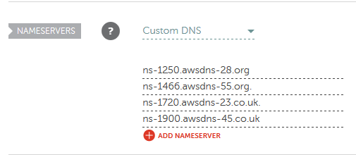

## Tyler's Blog. Week 4
#### What's new this week?

##### Finishing Project 1
Although Project 1 was much more organized than Project 0, we still have some work to do in terms of organization. This will be discussed during the presentation this coming Monday.

One of my tasks for this project was setting up the certificate for our web servers. Instead of doing this through certbot like in project 0, I used AWS Certificate Manager.


##### AWS Certificate Manager with Terraform
For Project 1, we were required to use Terraform for all of our infrastructure. In order to set up an AWS Certificate with Terraform you must do the following:

###### Setup Route 53

* Create a Route 53 hosted zone using Terraform.
* Populate the hosted zone with record sets (apex domain along with www, and blog subdomains).
* Setup your DNS server to point to Route 53 NS records in your hosted zone. (This must be done manually).


###### Request a certificate
* Request a certificate using Terraform for your apex
 domain and wildcard domain (\*.fa480.club).
* Add required CNAME records to Route 53 using Terraform *or*
* Manually confirm your DNS ownership with an Email.

The following is the process I used to obtain a certificate using Terraform.

##### Setting up Route 53

First, We have to create the Route 53 zone using Terraform.
```
resource "aws_route53_zone" "main" {
  name         = "fa480.club"
}
```

Then, we add 3 records to our zone. One for our apex domain, one for www and one for our blog subdomains.

```
resource "aws_route53_record" "www" {
  zone_id = "${aws_route53_zone.main.zone_id}"
  name    = "www.fa480.club"
  type    = "A"
  ttl     = "300"
  records = ["${aws_eip.lb.public_ip}"]
}
resource "aws_route53_record" "blog" {
  zone_id = "${aws_route53_zone.main.zone_id}"
  name    = "blog.fa480.club"
  type    = "A"
  ttl     = "300"
  records = ["${aws_eip.lb.public_ip}"]
}

resource "aws_route53_record" "apex" {
  zone_id = "${aws_route53_zone.main.zone_id}"
  name    = "fa480.club"
  type    = "A"
  ttl     = "300"
  records = ["${aws_eip.lb.public_ip}"]
}
```
Next, we have to connect our AWS nameservers to our namecheap dns, doing the following:


The nameservers listed are located in the NS record of our Route 53 zone. Now we are ready to request a certificate.

##### Requesting a Certificate
This also has to be done through terraform, and can be done in the following way:

```
resource "aws_acm_certificate" "cert" {
	domain_name = "fa480.club"
	subject_alternative_names = ["*.fa480.club"]
	validation_method = "DNS"
}
```
This creates a certificate in AWS ACM, specified to be validated through DNS.

At this point, if you were on the console, AWS would provide records you can simply click on to add to your route 53 zone, then be finished.

Because we are doing terraform however, we also need to add two additional resources to our route 53 for validation:

```
resource "aws_route53_record" "apex_validation" {
  name = "${aws_acm_certificate.cert.domain_validation_options.0.resource_record_name}"
  type = "${aws_acm_certificate.cert.domain_validation_options.0.resource_record_type}"
  zone_id = "${aws_route53_zone.main.zone_id}"
  records = ["${aws_acm_certificate.cert.domain_validation_options.0.resource_record_value}"]
  ttl = 60
}

resource "aws_route53_record" "wildcard_validation" {
  name = "${aws_acm_certificate.cert.domain_validation_options.1.resource_record_name}"
  type = "${aws_acm_certificate.cert.domain_validation_options.1.resource_record_type}"
  zone_id = "${aws_route53_zone.main.zone_id}"
  records = ["${aws_acm_certificate.cert.domain_validation_options.1.resource_record_value}"]
  ttl = 60
}
```
These simply take the two CNAME records that amazon provides, and adds them to the Route 53 zone.

Finally, we can add an aws_acm_certificate_validation resource to wait until the certificate gets authorized by AWS, but this step isn't required, and should authorize automatically after around an hour.

```
resource "aws_acm_certificate_validation" "cert" {
  certificate_arn = "${aws_acm_certificate.cert.arn}"
  validation_record_fqdns = [
    "${aws_route53_record.apex_validation.fqdn}",
    "${aws_route53_record.wildcard_validation.fqdn}",
  ]
}
```

Finally, we're done setting up our certificate and it can be added to the ALB on a port 443 listener to do decryption.
